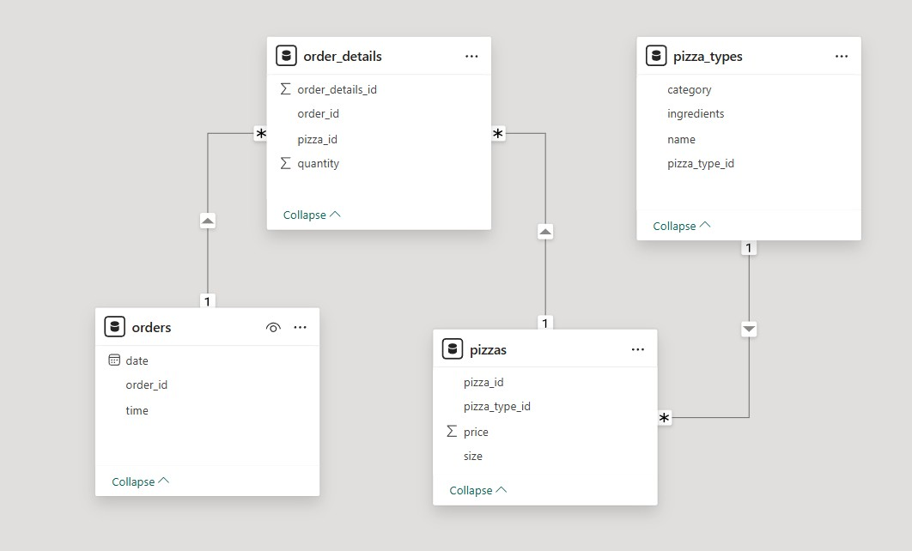

## 🍕 **Pizza Sales Analysis - SQL Project**

### 📌 **Overview**

This project analyzes pizza sales data using **SQL queries** to uncover key insights about orders, revenue, and pizza trends.

### 🛠 **Tools Used**

-   **SQL** (MySQL)

### 📊 **Dataset Schema**

The dataset consists of **4 tables**:

-   **orders** – Stores order details (`order_id`, `date`, `time`)
-   **order_details** – Stores each order’s pizzas (`order_id`, `pizza_id`, `quantity`)
-   **pizzas** – Contains pizza details (`pizza_id`, `price`, `size`)
-   **pizza_types** – Stores pizza names, categories, and ingredients (`pizza_type_id`)

📷 **Schema Diagram:**  

----------

## 🔎 **SQL Queries & Insights**

### 🔹 **Basic Analysis**

✔️ Total number of orders  
✔️ Total revenue generated  
✔️ Highest-priced pizza  
✔️ Most common pizza size  
✔️ Top 5 most ordered pizza types

### 🔸 **Intermediate Analysis**

✔️ Quantity of each pizza category ordered  
✔️ Orders distribution by hour  
✔️ Category-wise distribution of pizzas  
✔️ Average pizzas ordered per day  
✔️ Top 3 pizzas by revenue

### 🔺 **Advanced Analysis**

✔️ Percentage contribution of each pizza type to revenue  
✔️ Cumulative revenue over time  
✔️ Top 3 pizzas per category by revenue
